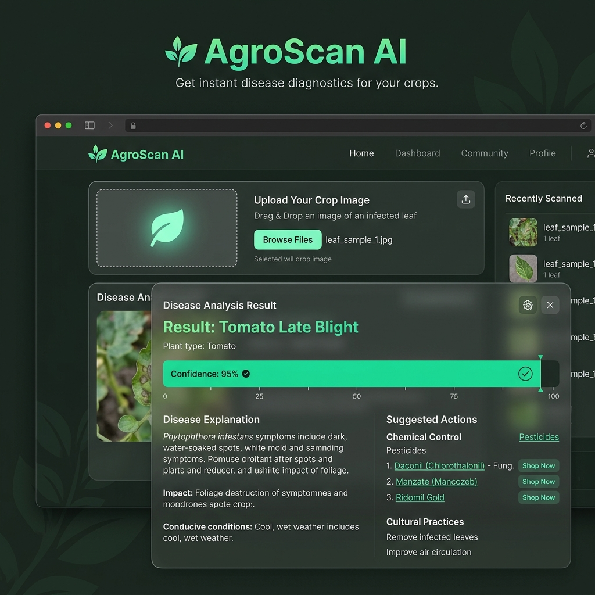

<div align="center">

# 🌿 AgroScan AI — Plant Disease Classifier

### *Instant AI-Powered Disease Diagnostics for Your Crops*



[](https://python.org)
[](https://tensorflow.org)
[](https://reactjs.org)
[](https://flask.palletsprojects.com)
[](https://nodejs.org)

---

**AgroScan AI** is a full-stack deep learning application that instantly identifies **38 plant diseases** across **14 crop species** from a single leaf image. It provides disease explanations, recommended pesticides with purchase links — all in **English & Hindi**.

[View Demo](#demo) · [Report Bug](https://github.com/ayansayyad2459-glitch/plant-disease-classifier/issues) · [Request Feature](https://github.com/ayansayyad2459-glitch/plant-disease-classifier/issues)

</div>

---

## 📋 Table of Contents

- [About The Project](#-about-the-project)
- [Features](#-features)
- [Tech Stack](#-tech-stack)
- [Architecture](#-architecture)
- [Supported Crops & Diseases](#-supported-crops--diseases)
- [Getting Started](#-getting-started)
- [Project Structure](#-project-structure)
- [Screenshots](#-screenshots)
- [Deployment](#-deployment)
- [Contributing](#-contributing)
- [License](#-license)
- [Contact](#-contact)

---

## 🔍 About The Project

Agriculture remains the backbone of the Indian economy, yet farmers lose **₹50,000+ crore annually** due to plant diseases that go undetected until it's too late. **AgroScan AI** bridges this gap by putting the power of deep learning directly into farmers' hands.

Simply **upload a photo** of a diseased leaf, and within seconds the AI model identifies the disease, explains its cause, and recommends specific pesticides — with direct purchase links. The bilingual support (**English + Hindi**) ensures accessibility for rural farmers across India.

### 🎯 Problem Statement
- Farmers often misidentify plant diseases, leading to incorrect pesticide usage
- Late diagnosis results in massive crop losses
- Limited access to agricultural experts in rural areas

### 💡 Our Solution
- **AI-powered instant diagnosis** from a single leaf photo
- **38 disease classifications** with detailed explanations
- **Pesticide recommendations** with one-click purchase links
- **Bilingual support** (English & Hindi) for wider accessibility

---

## ✨ Features

| Feature | Description |
|---------|-------------|
| 🤖 **AI Disease Detection** | Deep learning model (MobileNetV2) trained on 70K+ augmented images |
| 🌾 **38 Disease Classes** | Covers 14 crop species including Apple, Tomato, Corn, Grape, and more |
| 📊 **Confidence Score** | Visual confidence bar showing prediction accuracy |
| 💊 **Pesticide Suggestions** | Recommended treatments with Google Shopping purchase links |
| 🌐 **Bilingual UI** | Full English & Hindi language support |
| 🎨 **Glassmorphism Design** | Modern dark-theme UI with forest-inspired aesthetics |
| 📱 **Responsive Design** | Works seamlessly on desktop and mobile devices |
| ⚡ **Real-time Analysis** | Get results in seconds, not hours |

---

## 🛠 Tech Stack

### Frontend
| Technology | Purpose |
|-----------|---------|
| **React 19** | UI component framework |
| **Axios** | HTTP client for API calls |
| **CSS3** | Glassmorphism styling & animations |
| **Google Fonts (Inter)** | Modern typography |

### Backend
| Technology | Purpose |
|-----------|---------|
| **Node.js + Express 5** | API gateway & middleware |
| **Multer** | Image upload handling |
| **Axios** | Proxy requests to AI server |
| **CORS** | Cross-origin resource sharing |

### AI / ML
| Technology | Purpose |
|-----------|---------|
| **Python 3.9+** | ML runtime |
| **TensorFlow / Keras** | Deep learning framework |
| **MobileNetV2** | Pre-trained CNN (transfer learning) |
| **Flask** | AI prediction API server |
| **Pillow** | Image preprocessing |

---

## 🏗 Architecture

```
┌─────────────────┐     ┌─────────────────────┐     ┌─────────────────────┐
│   React App     │     │   Node.js Backend   │     │   Flask AI Server   │
│   (Port 3000)   │────▶│   (Port 5001)       │────▶│   (Port 5000)       │
│                 │     │                     │     │                     │
│  • Upload Image │     │  • Receive Image    │     │  • Load .h5 Model   │
│  • Show Results │     │  • Forward to Flask │     │  • Preprocess Image │
│  • Bilingual UI │     │  • Return Response  │     │  • Predict Disease  │
└─────────────────┘     └─────────────────────┘     └─────────────────────┘
```

**Data Flow:**
1. User uploads a leaf image via the React frontend
2. Image is sent to the Node.js Express backend (`/api/upload`)
3. Backend forwards the image to the Flask AI server (`/predict`)
4. Flask preprocesses the image and runs it through the MobileNetV2 model
5. Prediction (disease name, confidence, info) is returned back through the chain
6. React displays the results with disease details and pesticide recommendations

---

## 🌾 Supported Crops & Diseases

<details>
<summary><strong>Click to expand full list (38 classes across 14 crops)</strong></summary>

| # | Crop | Disease |
|---|------|---------|
| 1 | 🍎 Apple | Apple Scab |
| 2 | 🍎 Apple | Black Rot |
| 3 | 🍎 Apple | Cedar Apple Rust |
| 4 | 🍎 Apple | Healthy |
| 5 | 🫐 Blueberry | Healthy |
| 6 | 🍒 Cherry | Powdery Mildew |
| 7 | 🍒 Cherry | Healthy |
| 8 | 🌽 Corn | Cercospora Leaf Spot (Gray Leaf Spot) |
| 9 | 🌽 Corn | Common Rust |
| 10 | 🌽 Corn | Northern Leaf Blight |
| 11 | 🌽 Corn | Healthy |
| 12 | 🍇 Grape | Black Rot |
| 13 | 🍇 Grape | Esca (Black Measles) |
| 14 | 🍇 Grape | Leaf Blight (Isariopsis Leaf Spot) |
| 15 | 🍇 Grape | Healthy |
| 16 | 🍊 Orange | Haunglongbing (Citrus Greening) |
| 17 | 🍑 Peach | Bacterial Spot |
| 18 | 🍑 Peach | Healthy |
| 19 | 🫑 Pepper (Bell) | Bacterial Spot |
| 20 | 🫑 Pepper (Bell) | Healthy |
| 21 | 🥔 Potato | Early Blight |
| 22 | 🥔 Potato | Late Blight |
| 23 | 🥔 Potato | Healthy |
| 24 | 🫐 Raspberry | Healthy |
| 25 | 🫘 Soybean | Healthy |
| 26 | 🎃 Squash | Powdery Mildew |
| 27 | 🍓 Strawberry | Leaf Scorch |
| 28 | 🍓 Strawberry | Healthy |
| 29 | 🍅 Tomato | Bacterial Spot |
| 30 | 🍅 Tomato | Early Blight |
| 31 | 🍅 Tomato | Late Blight |
| 32 | 🍅 Tomato | Leaf Mold |
| 33 | 🍅 Tomato | Septoria Leaf Spot |
| 34 | 🍅 Tomato | Spider Mites (Two-Spotted) |
| 35 | 🍅 Tomato | Target Spot |
| 36 | 🍅 Tomato | Yellow Leaf Curl Virus |
| 37 | 🍅 Tomato | Mosaic Virus |
| 38 | 🍅 Tomato | Healthy |

</details>

---

## 🚀 Getting Started

### Prerequisites

Make sure you have the following installed:

- **Python 3.9+** — [Download](https://www.python.org/downloads/)
- **Node.js 18+** — [Download](https://nodejs.org/)
- **Git** — [Download](https://git-scm.com/)

### Installation

#### 1. Clone the Repository

```bash
git clone https://github.com/ayansayyad2459-glitch/plant-disease-classifier.git
cd plant-disease-classifier
```

#### 2. Set Up the AI Server (Python/Flask)

```bash
# Create a virtual environment
python -m venv venv

# Activate it
# Windows:
venv\Scripts\activate
# macOS/Linux:
source venv/bin/activate

# Install Python dependencies
pip install flask tensorflow pillow numpy
```

#### 3. Set Up the Backend (Node.js/Express)

```bash
cd backend
npm install
cd ..
```

#### 4. Set Up the Frontend (React)

```bash
cd frontend
npm install
cd ..
```

### Running the Application

You need **three terminal windows** to run the full application:

**Terminal 1 — AI Server (Flask):**
```bash
python app.py
# ✅ Runs on http://localhost:5000
```

**Terminal 2 — Backend (Node.js):**
```bash
cd backend
node server.js
# ✅ Runs on http://localhost:5001
```

**Terminal 3 — Frontend (React):**
```bash
cd frontend
npm start
# ✅ Opens on http://localhost:3000
```

> **Note:** The trained model file (`plant_disease_classifier.h5`) is not included in the repo due to its size (~11MB). You can either:
> - Train the model yourself using `train.py` (requires the dataset)
> - [Download the pre-trained model from releases](https://github.com/ayansayyad2459-glitch/plant-disease-classifier/releases)

---

## 📁 Project Structure

```
plant-disease-classifier/
│
├── app.py                          # Flask AI prediction server
├── train.py                        # Model training script (MobileNetV2)
├── class_indices.json              # Disease class label mapping
├── plant_disease_classifier.h5     # Trained model (not in repo)
├── .gitignore                      # Git ignore rules
│
├── backend/                        # Node.js Express API gateway
│   ├── server.js                   # Express server with image proxy
│   └── package.json
│
├── frontend/                       # React application
│   ├── public/
│   │   └── index.html
│   ├── src/
│   │   ├── App.js                  # Main React component
│   │   ├── App.css                 # Glassmorphism styling
│   │   └── index.js                # React entry point
│   └── package.json
│
└── test/                           # Test images for validation
```

---

## 📸 Screenshots

<div align="center">

### Home Page — Upload Interface
> Sleek dark-themed interface with glassmorphism cards and an inviting drag-and-drop upload zone.

### Disease Analysis Result
> Detailed results showing disease name, confidence score with progress bar, explanation in selected language, and pesticide recommendations with purchase links.

### Bilingual Support (Hindi)
> Full Hindi language support for disease explanations and pesticide names, making the tool accessible to rural Indian farmers.

</div>

---

## 🚀 Deployment

### Frontend — Vercel / Netlify
```bash
cd frontend
npm run build
# Deploy the `build/` folder to Vercel or Netlify
```

### Backend — Render / Railway
1. Push the `backend/` folder to a separate repo or use a monorepo deploy
2. Set the start command to `node server.js`
3. Update the Flask AI URL in `server.js` to point to your deployed Flask app

### AI Server — Render / Railway / AWS EC2
1. Deploy `app.py` along with the model file
2. Install dependencies: `flask tensorflow pillow numpy`
3. Update the backend's `pythonApiUrl` to point to the deployed Flask URL

### Environment Variables
Update the following URLs after deployment:
- **Frontend** → `App.js`: Change `http://localhost:5001/api/upload` to your deployed backend URL
- **Backend** → `server.js`: Change `http://127.0.0.1:5000/predict` to your deployed Flask URL

---

## 🤝 Contributing

Contributions make the open-source community such an amazing place to learn, inspire, and create. Any contributions you make are **greatly appreciated**.

1. **Fork** the Project
2. **Create** your Feature Branch (`git checkout -b feature/AmazingFeature`)
3. **Commit** your Changes (`git commit -m 'Add some AmazingFeature'`)
4. **Push** to the Branch (`git push origin feature/AmazingFeature`)
5. **Open** a Pull Request

---

## 📝 License

Distributed under the **MIT License**. See `LICENSE` for more information.

---

## 📧 Contact

**Ayan Sayyad** — Full Stack Developer & ML Enthusiast

[](https://github.com/ayansayyad2459-glitch)

---

<div align="center">

### ⭐ Star this repo if you found it helpful!

*Built with ❤️ by Ayan Sayyad*

</div>
